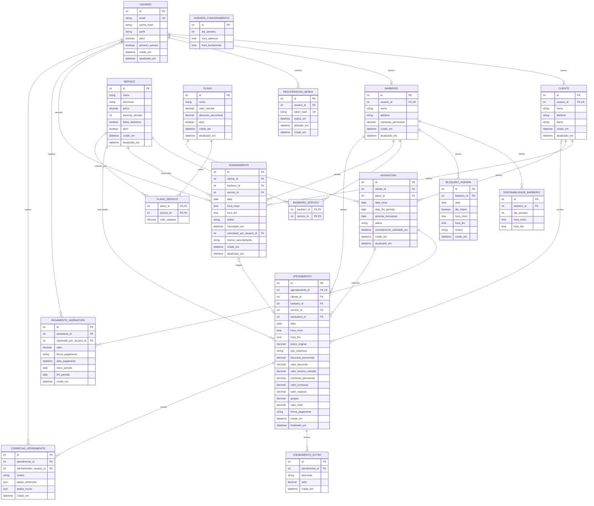

# DER e modelagem — api-barbearia

## 1. Princípios

- O modelo é relacional e representa uma única barbearia.
- IDs são `Int` autoincrementais.
- Dinheiro usa `Decimal/Numeric`, nunca ponto flutuante.
- Datas financeiras e valores aplicados são históricos.
- Relacionamentos importantes não são removidos em cascata de forma destrutiva.
- Campos opcionais aparecem como nulos somente quando o caso de negócio realmente permite.
- `Servico.duracao_minutos` permanece explícito, mas na V1 só aceita o valor `30`.
- `RecuperacaoSenha` permanece no schema por ter entrado na migration inicial já aplicada; não é usada pela V1.
- O Administrador é representado diretamente por `Usuario`; não há tabela própria de Administrador.
- Atendimento avulso de pessoa sem conta não gera `Cliente` fictício.

## 2. DER lógico



Campos sem marcação explícita de nulabilidade no Mermaid devem seguir as regras abaixo; o diagrama mostra o desenho lógico, não substitui o `schema.prisma` e as migrations.

## 3. Nulabilidade e invariantes relevantes

- `Cliente.usuario_id` e `Barbeiro.usuario_id` são únicos e obrigatórios.
- `Cliente.bairro` é obrigatório.
- `Servico.descricao` é opcional; `duracao_minutos = 30`.
- Em `BloqueioAgenda`, horas são nulas somente quando `dia_inteiro = true`.
- Campos de cancelamento do Agendamento são nulos enquanto não cancelado.
- `Atendimento.agendamento_id`, `cliente_id` e `assinatura_id` são opcionais.
- `Atendimento.barbeiro_id` e `servico_id` são obrigatórios.
- `Atendimento.agendamento_id` é único quando informado.
- `Atendimento.forma_pagamento` pode ser nulo apenas quando `valor_total = 0`.
- `RecuperacaoSenha` não recebe novos registros na V1. O desenho físico existente será reavaliado quando a recuperação de senha for definida para uma versão posterior.
- Percentuais ficam entre 0 e 100; valores monetários não podem ser negativos.
- Horas iniciais devem ser menores que horas finais.
- Cada `Agendamento` ocupa um único intervalo `[hora_inicio, hora_fim)` de 30 minutos, mesmo para `Corte + Barba`.

## 4. Enums de domínio

```text
PerfilUsuario
├── CLIENTE
├── BARBEIRO
└── ADMINISTRADOR

StatusAgendamento
├── AGENDADO
├── CONCLUIDO
├── CANCELADO
└── FALTOU

StatusAssinatura
├── ATIVA
├── CANCELAMENTO_AGENDADO
└── EXPIRADA

TipoCobertura
├── NORMAL
├── ASSINATURA
└── ASSINATURA_COM_DESCONTO

FormaPagamento
├── PIX
├── DINHEIRO
├── CREDITO
└── DEBITO
```

## 5. Valores históricos

`Servico.preco`, `Barbeiro.comissao_percentual`, `Plano.desconto_percentual` e `PlanoServico.valor_repasse` representam configurações atuais. Ao concluir um Atendimento, os valores aplicados são copiados para o próprio Atendimento.

Assim, alterar um preço ou percentual amanhã não modifica o passado. Da mesma forma, `PagamentoAssinatura` preserva o valor e o período pagos.

## 6. Restrições de consistência

1. E-mail globalmente único e normalizado.
2. Uma associação `Usuario–Cliente` ou `Usuario–Barbeiro` por conta, coerente com o perfil.
3. Disponibilidades de um Barbeiro não se sobrepõem.
4. Slots `AGENDADO` do mesmo Barbeiro não se sobrepõem.
5. O mesmo Cliente não mantém o mesmo Serviço duas vezes no mesmo dia.
6. Apenas uma Assinatura vigente por Cliente.
7. Apenas um Atendimento por Agendamento.
8. Serviço específico precisa de ao menos um Barbeiro associado para ser ofertado.
9. Atendimento coberto usa repasse; Atendimento pago usa comissão.
10. Correção de Atendimento exige Administrador e motivo.
11. Cliente não possui Agendamentos ativos sobrepostos, mesmo com Barbeiros diferentes.
12. Atendimento avulso não pode sobrepor outro compromisso do Barbeiro no mesmo período.
13. Assinatura exige Cliente cadastrado; benefícios não se aplicam a Atendimento sem `cliente_id`.
14. Desativação de Barbeiro, Cliente ou Serviço com compromissos futuros exige resolver esses compromissos antes.
15. Cancelamento de Assinatura mantém benefícios até o fim do ciclo mensal individual já pago.

Algumas invariantes exigem combinação de validação no Service e constraint/índice criado por migration SQL. O banco é a última linha de defesa contra concorrência.

## 7. Configuração inicial dos Planos e reflexo financeiro

| Plano | Mensalidade | Serviços cobertos |
|---|---:|---|
| Assinatura de Corte | R$ 100,00 | Corte |
| Assinatura Completa | R$ 110,00 | Corte, Barba e Corte + Barba |

Ambos permitem uso ilimitado dos Serviços cobertos durante a vigência e desconto configurável nos Serviços não cobertos. O percentual de desconto pertence a `Plano`; o repasse fixo por Serviço coberto pertence a `PlanoServico`. Os valores exatos de desconto e repasse ainda devem ser configurados, sem presumir números.

`Assinatura` representa a contratação por um Cliente. `PagamentoAssinatura` registra manualmente cada período pago e o Administrador responsável. O cancelamento solicitado mantém a Assinatura vigente até `data_fim_periodo`.

No Atendimento, `preco_original` preserva o preço comercial. Um Serviço coberto grava `valor_servico_cobrado = 0`, `valor_comissao = 0` e `valor_repasse` aplicado. Um Serviço pago, inclusive com desconto de assinante, usa comissão sobre `valor_servico_cobrado`; o padrão é 50%. `gorjeta` pertence integralmente ao Barbeiro e fica fora do faturamento. `valor_total` inclui a gorjeta paga pelo Cliente, enquanto a receita da barbearia soma apenas Serviço cobrado e Extras.

## 8. Interpretação dos horários

`Agendamento.data`, `hora_inicio` e `hora_fim` descrevem um único slot civil de 30 minutos. Os slots são calculados, não armazenados separadamente. A criação exige antecedência de 1h30 a 7 dias; cancelamento e reagendamento pelo Cliente exigem pelo menos 2 horas antes do início atual. O Barbeiro pode cancelar somente seus próprios Agendamentos; o Administrador pode cancelar qualquer um.
